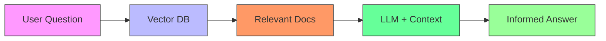

# LLM & RAG Project with Ollama

This projects demonstrates how to use **Ollama** to run open-source LLMs (like LLaMA 3) and implement Retrieval-Augmented Generation (RAG).

## 🚀 Quick Start

### Prerequisites
- [Ollama installed](https://ollama.ai) (Supports Windows/macOS/Linux)
- Python 3.8+ (for RAG implementation)
- `pip` for Python packages

### 1. Install Ollama
```bash
# Linux/macOS (terminal):
curl -fsSL https://ollama.ai/install.sh | sh

# Windows:
# Download installer from https://ollama.ai/download
```

### 2. Download and run LLaMA 3
```bash
# Available models: llama3, mistral, gemma, etc.
ollama pull llama3     # Downloads LLaMA 3 (8B parameter version)
ollama run llama3      # Starts interactive chat
```


### 3. Integrate with Python
```bash
pip install ollama
```

## 🤖 About LLMs & RAG
### Large Language Models (LLMs)
LLMs (like LLaMA 3, GPT-4) are AI models trained on vast text data to understand/generate human-like text. Ollama lets you run them locally.

### Retrieval-Augmented Generation (RAG)

RAG enhances LLMs by:

Retrieving relevant documents from a knowledge base.

Augmenting the LLM's response with this context.
